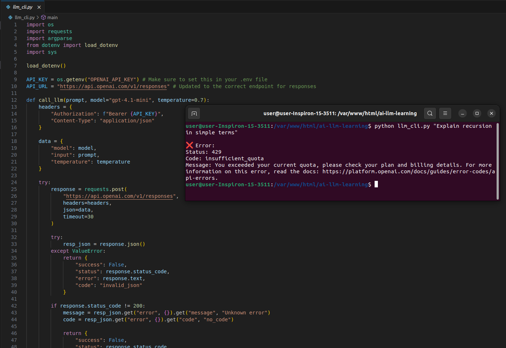

# 🤖 AI Terminal Assistant (LLM CLI)


> *Note: A lightweight Command Line Interface (CLI) tool to interact with Large Language Models directly from the terminal.*

## 📖 Overview
As a Senior Backend Developer expanding my stack into the Python ecosystem, I built this CLI application to streamline my development workflow. It allows for rapid, context-free querying of Large Language Models (LLMs) without leaving the terminal or switching to a web browser. 

The tool handles API communication, parses responses, supports custom model parameters, and gracefully catches API constraints like quota limits.

## ✨ Features
*   **Direct Terminal Interaction:** Ask questions and get formatted responses straight in your CLI.
*   **Parameter Control:** Dynamically adjust the model type and temperature (creativity) via command-line arguments.
*   **Robust Error Handling:** Beautifully formatted error catching for API rate limits (`429 insufficient_quota`) and connection issues.
*   **Extensible Architecture:** Designed to easily swap out API providers (e.g., OpenAI, Google Gemini, Groq, or local Ollama models).

## 🚀 Installation & Setup

1. **Clone the repository:**
   ```bash
   git clone [https://github.com/Hari2892/ai-llm-learning.git](https://github.com/Hari2892/ai-llm-learning.git)
   cd ai-llm-learning